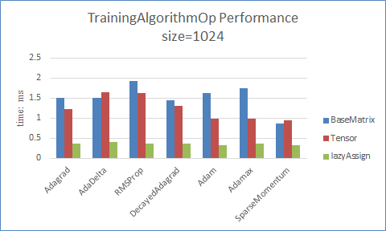
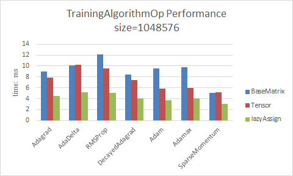

This is a documentation for matrix/tensor calculation in paddle.

# Why need TensorExpression?
Currently, BaseMatrix has supported a wide variety of matrix-related expression evaluations. 
Like, element-wise calculate(calculate with matrix/vector, matrix and vector, and sub-matrix), 
aggregate calculate(aggregate to row/column vector).
But, `BaseMatrix` has a big drawback, all calculation functions are defined in `BaseMatrix`,
and `BaseMatrix` will become larger and larger. 
You may need a new API, but you are not sure if `BaseMatrix` has supported. 
Or you want to define a new API, but found duplicate names.

## Simpler calculation definition
If use `BaseMatrix` define a calculation function, this requires two steps.
1. Use `hl_matrix_ops.cuh` define calculation expressions;
2. Define a calculation API in `BaseMatrix`;

For example: define a sgdUpdate function in `BaseMatrix`
```
DEFINE_MATRIX_TERNARY_PARAMETER_OP(SgdUpdate, THREE_PARAMETER,
                                   c = p2 * c - p1 * (b + p3 * a);
                                   a = a + c);
template<class T>
void BaseMatrixT<T>::sgdUpdate(BaseMatrixT& b,  // grad
                               BaseMatrixT& c,  // mom
                               T p1,        // learningRate,
                               T p2,        // momentum,
                               T p3) {      // decayRate
  applyTernary(ternary::SgdUpdate<T>(p1, p2, p3), b, c);
}
```

If use `TensorExpression` define a calculation function, this only one step.
```
template<typename Tensor>
void sgdUpdate(Tensor& A, Tensor& B, Tensor& C,
     real p1, real p2, real p3) {
  C = C * p2 - (B + A * p3) * p1;
  A += C;
}
```

## Better performance optimization
Use `lazyAssign` and `AssignEvaluate`,
we can define multiple expressions into one evaluation function(If use GPU, that is defined into one Kernel to calculate).
Of course, with `BaseMatrix` can also define multiple expressions into one function, 
however, due to a combination of various expressions, doing so will make `BaseMatrix` become larger.

# How to use TensorExpression
## Which expressions have been implemented in TensorExpression
Various element-wise calculations have been implemented. 
For example:
1. `A = op(A)` various unary expression and `op` is operator defined in TensorExpression(like +-*/><=...)
1. `A = B op C...` various binary expression and `op` is operator defined in TensorExpression(like +-*/><=...)
2. `A = (B > C).condition(B, C)` conditional expression and `condition` is `?:` operator. This expression is equivalent to ` A = B > C ? B : C`

## Which classes support expression operation
For example `A = B op C` and op is operator defined in TensorExpression(like +-*/...)
- If A B C are one of BaseMatrix, CpuMatrix, GpuMatrix, CpuVector, GpuVector class, this expression is ok.
- Matrix, Vector class is not support. Because Matrix and Vector are abstract type. And the compiler may report the following error.
```
TensorExpression.h:351:17: error: cannot declare field 'paddle::TensorBinaryOp<hppl::binary::add<float>, const paddle::BaseMatrixT<float>, const paddle::Matrix, float>::rhs_' to be of abstract type 'paddle::Matrix'
   const RhsType rhs_;
```
- If B is CpuMatrix and C is GpuMatrix, compiler will not report an error, but the program will run an error(`CHECK_EQ(lhs_.useGpu(), rhs_.useGpu())`).


## About Compiler
TensorExpression.h does not require c++11 related features support, so without c++11/c++0x can be compiled successfully.
Expression calculation based on `BaseMatrix` class is also not required compile with c++11/c++0x.
There are some c++11 related code in the file `Matrix.h` and `Vector.h` (like std::shared_ptr), 
so if you want to compile an expression based on the `CpuMatrix`, `GpuMatrix`, `CpuVector`, `GpuVector` class,
this need to increase c++11/c++0x compiler option.

Examples: A = B + C (A/B/C is BaseMatrix class or Cpu/GpuMatrix class or Cpu/GpuVector class)
1. Base on BaseMatrix, (used by TrainingAlgorithmOp.h). need gcc4.6 and nvcc5.5 above.
2. Base on Cpu/GpuMatrix or Cpu/GpuVector, (used in test_Tensor.cu). 
If only cpu version is compiled, need gcc4.6 above and c++0x/c++11 option.
And if compile gpu version need gcc4.7 & nvcc7.0 above and c++11 option. Because nvcc does not support c++0x option, and gcc4.7 above support c++11 option.


# Lazy Assignment and Evaluate multiple expressions in one kernel
One of the main functions of lazy assignment is to evaluate multiple expressions in one evaluation function.
For example, we want to calculate the following two expressions,
```
A = B + C;
D = A * D;
```
Without lazy assignment, there will be evaluated two kernel function. Think about the calculation under the GPU,
First kernel function call will calculate the result of B plus C, and requires two loads and one store operation.
Second kernel function call will calculate the result of A multiplied D, and also requires two loads and one store operation.
So, the calculation of these two expressions, including the two kernels launch, four loads operation, two stores operation.
IF use lazy Assignment, these two expressions can be evaluated as follows,
```
auto expr1 = A.lazyAssign(B + C);
auto expr2 = D.lazyAssign(A * D);
AssignEvaluate(expr1, expr2);
```
There is only one kernel launche, and only three loads operation and one store operation. 

## TrainingAlgorithmOp Performance
There are three different implementations of the TrainingAlgorithmOp, including BaseMatrix-based implementation(OriginalOptimizerApi.h),
TensorExpression-based implementation and lazyAssign-based implementation(TrainingAlgorithmOp.cu).
The test see `test_TrainingAlgorithm.cpp`, and the performance of various implementations are as follows:
- When matrix size is small, the lazyAssign-based's performance is 4 times better than BaseMatrix-based's.  

- When matrix size is large, the lazyAssign-based's performance is 2 times better than BaseMatrix-based's.  



